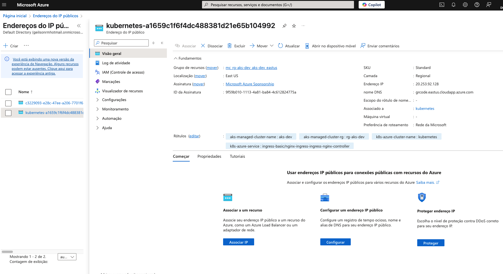

# Qual ip está em uso
kubectl get svc -A -o wide | grep LoadBalancer

# Obter NSG
az network nsg list --query "[].{Name:name,ResourceGroup:resourceGroup}" -o table

# Criar regra para liberar porta 80 (HTTP):
az network nsg rule create \
  --resource-group rg-aks-dev \
  --nsg-name <NOME_DO_NSG> \
  --name Allow-HTTP \
  --priority 100 \
  --direction Inbound \
  --access Allow \
  --protocol Tcp \
  --source-address-prefixes '*' \
  --destination-port-ranges 80


az network nsg rule create \
  --resource-group mc_rg-aks-dev_aks-dev_eastus \
  --nsg-name aks-agentpool-16181975-nsg \
  --name Allow-HTTP \
  --priority 100 \
  --direction Inbound \
  --access Allow \
  --protocol Tcp \
  --source-address-prefixes '*' \
  --destination-port-ranges 80


# Se persistir, tente forçar a atualização da regra de roteamento trocando de ExternalTrafficPolicy:
  ```
helm upgrade nginx-ingress ingress-nginx/ingress-nginx \
  --namespace ingress-basic \
  --set controller.service.externalTrafficPolicy=Local
  ```
